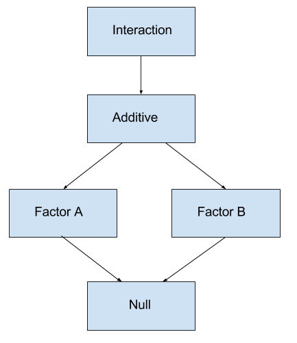

# Análisis de varianza

**Estado del capítulo:** Este capítulo debe considerarse opcional para una primera lectura de este texto. Su inclusión es principalmente en beneficio de algunos cursos que utilizan el texto.

```{r, include = FALSE}
knitr::opts_chunk$set(cache = TRUE, autodep = TRUE, fig.align = "center")
```

<style type="text/css">
.table {

    width: 70%;
    margin-left:10%; 
    margin-right:10%;

}
</style>

<!-- TODO: use kable styling instead of custom CSS -->

> "Para saber qué sucede cuando cambia algo, es necesario cambiarlo."
>
> --- **Box, Hunter, and Hunter**, Statistics for Experimenters (1978)

Hasta ahora, hemos construido modelos para respuestas numéricas, cuando los predictores son todos numéricos. Tomaremos un pequeño desvío para volver atrás y considerar modelos que *solo* tienen predictores **categóricos**. Un predictor categórico es una variable que toma solo un número finito de valores, que no están ordenados. Por ejemplo, una variable que toma como valores posibles `rojo`,` azul`, `verde` es categórica. En el contexto de usar una variable categórica como predictor, colocaría las observaciones en diferentes grupos (categorías).

También hemos estado tratando principalmente con datos de observación. Los métodos de esta sección son más útiles en entornos experimentales, pero aún funcionan con datos de observación. (Sin embargo, para determinar la causalidad, necesitamos experimentos).

## Experimentos

La mayor diferencia entre un estudio observacional y un experimento es *cómo* se obtienen los datos del predictor. ¿Tiene el experimentador el control?

- En un estudio **observacional**, tanto los datos de respuesta como los predictores se obtienen mediante observación.
- En un **experimento**, los datos del predictor son valores determinados por el experimentador. Se ejecuta el experimento y se observa la respuesta.

En un experimento, los predictores, que son controlados por el experimentador, se denominan **factores**. Los posibles valores de estos factores se denominan **niveles**. Los sujetos se asignan *al azar* a un nivel de cada uno de los factores.

El diseño de experimentos podría ser un curso en sí mismo. El artículo de Wikipedia sobre [diseño de experimentos](https://en.wikipedia.org/wiki/Design_of_experiments){target="_blank"} ofrece una buena descripción general. Originalmente, la mayor parte de la metodología fue desarrollada para aplicaciones agrícolas por [R. A. Fisher](https://en.wikipedia.org/wiki/Ronald_Fisher){target="_blank"}, pero hoy todavía están en uso, ahora en una amplia variedad de áreas de aplicación. En particular, estos métodos han experimentado un resurgimiento como parte de las "pruebas A/B".

<!-- TODO: In the future, discuss the Morrow Plots: http://cropsci.illinois.edu/research/morrow -->

## Prueba t de dos muestras

El ejemplo más simple de un diseño experimental es la configuración de una prueba $t$ de dos muestras. Hay una variable de factor único con dos niveles que divide a los sujetos en dos grupos. A menudo, un nivel se considera el **control**, mientras que el otro es el **tratamiento**. Los sujetos se asignan aleatoriamente a uno de los dos grupos. Después de ser asignado a un grupo, cada sujeto tiene una cantidad medida, que es la variable de respuesta.

Matemáticamente, consideramos el modelo

\[
y_{ij} \sim N(\mu_i, \sigma^2)
\]

donde $i= 1,2$ para los dos grupos y $j=1,2,\ldots n_i$. Aquí $n_i$ es el número de sujetos en el grupo $i$. Entonces $y_{13}$ sería la medida para el tercer miembro del primer grupo.

Por tanto, las mediciones de los sujetos del grupo $1$ siguen una distribución normal con una media de $\mu_1$.

\[
y_{1j} \sim N(\mu_1, \sigma^2)
\]

Luego, las mediciones de los sujetos en el grupo $2$ siguen una distribución normal con media $\mu_2$.

\[
y_{2j} \sim N(\mu_2, \sigma^2)
\]

Este modelo hace una serie de suposiciones. Específicamente,

- Las observaciones siguen una distribución **normal**. La media de cada grupo es diferente.
- **Varianza igual** para cada grupo.
- **Independencia**. Lo cual es creíble si los grupos fueran asignados al azar.

Más adelante, investigaremos los supuestos de varianza normal e igual. Por ahora, continuaremos asumiendo que son razonables.

La pregunta natural que se debe hacer: ¿hay alguna diferencia entre los dos grupos? La pregunta específica que responderemos: ¿Son diferentes las medias de los dos grupos?

Matemáticamente, es

\[
H_0: \mu_1 = \mu_2 \quad \text{vs} \quad H_1: \mu_1 \neq \mu_2
\]

Para el modelo establecido y asumiendo que la hipótesis nula es verdadera, el estadístico de prueba $t$ seguiría una distribución $t$ con $n_1+n_2-2$ grados de libertad.

```{r, echo = FALSE}
set.seed(42)
sleep_means = c(6.5, 8.2)
sleep_sigma = 1.2

melatonin = data.frame(
  sleep = rnorm(n = 20, mean = sleep_means, sd = sleep_sigma),
  group = rep(c("control", "tratamiento"), 10)
)
```

Como ejemplo, suponga que estamos interesados en el efecto de la [melatonina](https://en.wikipedia.org/wiki/Melatonin){target="_blank"} sobre la duración del sueño. Un investigador obtiene una muestra aleatoria de 20 varones adultos. De estos sujetos, 10 se eligen al azar para el grupo de control, que recibirá un placebo. Los 10 restantes recibirán 5 mg de melatonina antes de acostarse. Luego se mide la duración del sueño en horas de cada sujeto. El investigador elige un nivel de significancia de $\alpha=0.10$. ¿La melatonina afectó la duración del sueño?

```{r}
melatonin
```

Aquí, nos gustaría probar,

\[
H_0: \mu_C = \mu_T \quad \text{vs} \quad H_1: \mu_C \neq \mu_T
\]

Para hacerlo en `R`, usamos la función `t.test()`, con el argumento `var.equal` establecido en `TRUE`.

```{r}
t.test(sleep ~ group, data = melatonin, var.equal = TRUE)
```

A un nivel de significancia de $\alpha=0.10$, rechazamos la hipótesis nula. Parece que la melatonina tuvo un efecto **estadísticamente significativo**. Tenga en cuenta que la significación estadística no siempre es la misma que la **significación científica o práctica**. Para determinar la importancia práctica, necesitamos investigar el **tamaño del efecto** en el contexto de la situación. Aquí, el tamaño del efecto es la diferencia de las medias muestrales.

```{r}
t.test(sleep ~ group, data = melatonin, var.equal = TRUE)$estimate
```

Aquí vemos que los sujetos del grupo de melatonina duermen un promedio de aproximadamente 1,5 horas más que el grupo de control. ¡Una hora y media de sueño es ciertamente importante!

Con un tamaño de muestra lo suficientemente grande, podríamos hacer un tamaño del efecto de, digamos, cuatro minutos estadísticamente significativo. ¿Vale la pena tomar una pastilla todas las noches para dormir cuatro minutos más? (Probablemente no.)

```{r}
boxplot(sleep ~ group, data = melatonin, col = 5:6)
```

<!-- TODO: other parametarization, explain identify -->

## ANOVA de una vía

¿Y si hay más de dos grupos? Considere el modelo

\[
y_{ij} = \mu + \alpha_i + e_{ij}.
\]

donde

\[
\sum \alpha_i = 0
\]

y

\[
e_{ij} \sim N(0,\sigma^{2}).
\]

Aquí,

- $i = 1, 2, \ldots g$ donde $g$ es el número de grupos.
- $j = 1, 2, \ldots n_i$ donde $n_i$ es el número de observaciones en el grupo $i$.

Entonces el tamaño total de la muestra es

\[
N = \sum_{i = 1}^{g} n_i
\]

Las observaciones del grupo $i$ siguen una distribución normal

\[
y_{ij} \sim N(\mu_i,\sigma^{2})
\]

donde la media de cada grupo viene dada por

\[
\mu_i = \mu + \alpha_i.
\]

Aquí $\alpha_i$ mide el efecto del grupo $i$. Es la diferencia entre la media general y la media del grupo $i$.

Esencialmente, las suposiciones son las mismas que las del caso de dos muestras, sin embargo ahora, simplemente tenemos más grupos.

Al igual que en el caso de dos muestras, nuevamente nos gustaría probar si las medias de los grupos son iguales.

\[
H_0: \mu_1 = \mu_2 = \ldots \mu_g \quad \text{vs} \quad H_1: \text{ No todos los } \mu_i \text{ son iguales.}
\]

Observe que la alternativa simplemente indica que algunas de las medias no son iguales, no específicamente cuáles de las medias no son iguales. Más sobre eso después.

Alternativamente, podríamos escribir

\[
H_0: \alpha_1 = \alpha_2 = \ldots = \alpha_g = 0 \quad \text{vs} \quad H_1: \text{ No todos los } \alpha_i \text{ son } 0.
\]

Esta prueba se llama **Análisis de varianza**. El análisis de varianza (ANOVA) compara la variación debida a fuentes específicas (entre grupos) con la variación entre individuos que deberían ser similares (dentro de los grupos). En particular, ANOVA prueba si varias poblaciones tienen la misma media comparando qué tan alejadas están las medias de la muestra con cuánta variación hay dentro de las muestras. Usamos la variabilidad de medias para probar la igualdad de medias, de ahí el uso de *varianza* en el nombre para una prueba sobre medias.

Dejaremos fuera la mayoría de los detalles sobre cómo se realiza la estimación, pero veremos más adelante, que se realiza mediante mínimos cuadrados. Usaremos `R` para obtener estas estimaciones, pero en realidad son bastante simples. Basta pensar en las medias muestrales de los grupos.

- $\bar{y}_i$ es la media muestral del grupo $i$.
- $\bar{y}$ es la media muestral general.
- $s_{i}^{2}$ es la varianza muestral del grupo $i$.

Luego descompondremos la varianza, como hemos visto antes en la regresión. La variación **total** mide cuánto varían las observaciones sobre la media general de la muestra, *ignorando los grupos*.

\[
SST = \sum_{i = 1}^{g} \sum_{j = 1}^{n_i} (y_{ij} - \bar{y})^2
\]

La variación **entre** grupos analiza qué tan lejos están las medias de la muestra individual de la media general de la muestra.

\[
SSB = \sum_{i = 1}^{g} \sum_{j = 1}^{n_i} (\bar{y}_i - \bar{y})^2 = \sum_{i = 1}^{g} n_i (\bar{y}_i - \bar{y})^2
\]

Por último, la variación **dentro de** grupo mide qué tan lejos están las observaciones de la media muestral de su grupo.

\[
SSW = \sum_{i = 1}^{g} \sum_{j = 1}^{n_i} (y_{ij} - \bar{y}_i)^2 = \sum_{i = 1}^{g} (n_i - 1) s_{i}^{2}
\]

Esto también podría pensarse como la suma de los cuadrados del error, donde $y_{ij}$ es una observación y $\bar{y}_i$ es su valor ajustado (predicho) del modelo.

Para desarrollar el estadístico de prueba para ANOVA, colocamos esta información en una tabla ANOVA.

| Fuente  | Suma de cuadrados | Grados de libertad | Cuadrado medio | $F$         |
|---------|--------------|----------------|------------|-------------|
| Entre   | SSB            | $g - 1$            | SSB / DFB | MSB / MSW |
| Dentro  | SSW            | $N - g$            | SSW / DFW |             |
| Total   | SST            | $N - 1$            |             |             |

Rechazamos al hipótesis nula (medias iguales) cuando la estadística $F$ es grande. Esto ocurre cuando la variación entre grupos es grande en comparación con la variación dentro de los grupos. Bajo la hipótesis nula, la distribución del estadístico de prueba es $F$ con grados de libertad $g-1$ y $N-g$.

```{r, echo = FALSE}
library(broom)
plot_anova = function(n = 20, mu_a = 0, mu_b = 0, mu_c = 0, sigma = 1) {

  response = rnorm(n * 3, mean = c(mu_a , mu_b, mu_c), sd = sigma)
  group    = factor(rep(LETTERS[1:3], n))
  
  xmin = min(c(mu_a , mu_b, mu_c)) - 3 * sigma
  xmax = max(c(mu_a , mu_b, mu_c)) + 3 * sigma
  
  plot(0, main = "Verdaderos", 
       xlim = c(xmin, xmax), ylim = c(0, 0.40), type = "n", 
       xlab = "observaciones", ylab = "densidad")
  
  curve(dnorm(x, mean = mu_a, sd = sigma), 
        from = mu_a - 3 * sigma, to = mu_a + 3 * sigma, 
        add = TRUE, lwd = 2, col = "dodgerblue", lty = 1)
  
  curve(dnorm(x, mean = mu_b, sd = sigma), 
        from = mu_b - 3 * sigma, to = mu_b + 3 * sigma, 
        add = TRUE, lwd = 2, col = "darkorange", lty = 2)
  
  curve(dnorm(x, mean = mu_c, sd = sigma), 
        from = mu_c - 3 * sigma, to = mu_c + 3 * sigma, 
        add = TRUE, lwd = 3, col = "black", lty = 3)

  rug(response[group == "A"], col = "dodgerblue",
      lwd = 1.5, ticksize = 0.1, quiet = TRUE, lty = 1)
  rug(response[group == "B"], col = "darkorange", 
      lwd = 1.5, ticksize = 0.1, quiet = TRUE, lty = 2)
  rug(response[group == "C"], col = "black",
      lwd = 2, ticksize = 0.1, quiet = TRUE, lty = 3)
  
  boxplot(response ~ group, xlab = "grupo", main = "Datos observados", medcol = "white", varwidth = FALSE)
  stripchart(response ~ group, vertical = TRUE, method = "jitter", add = TRUE, 
             pch = 20, col  = c("dodgerblue", "darkorange", "black"))
  
  abline(h = mean(response), lwd = 3, lty = 1, col = "darkgrey")

  segments(x0 = 0.6, x1 = 1.4, y0 = mean(response[group == "A"]), y1 = mean(response[group == "A"]), lwd = 2, lty = 2, col = "dodgerblue")
  segments(x0 = 1.6, x1 = 2.4, y0 = mean(response[group == "B"]), y1 = mean(response[group == "B"]), lwd = 2, lty = 2, col = "darkorange")
  segments(x0 = 2.6, x1 = 3.4, y0 = mean(response[group == "C"]), y1 = mean(response[group == "C"]), lwd = 2, lty = 2, col = "black")

  # use lm en lugar de aov para facilitar el uso con broom::glance
  aov_results = lm(response ~ group) 
  f_stat = glance(aov_results)$statistic
  p_val  = glance(aov_results)$p.value
  list(f = f_stat, p = p_val)
  # summary(aov_results)
}
```

<!-- TODO: This should be a Shiny app. -->
<!-- TODO: Should output entire ANOVA table. -->
<!-- TODO: Do with ggplot2 and custom boxplots with show min, sd, mean, sd, max -->

```{r, echo = FALSE, eval = FALSE}
library(manipulate)
par(mfrow = c(1, 2))
manipulate(plot_anova(n, mu_a, mu_b, mu_c, sigma), 
           n = slider(2, 50, 20), 
           mu_a = slider(-10, 10, 0), 
           mu_b = slider(-10, 10, 0), 
           mu_c = slider(-10, 10, 0), 
           sigma = slider(0, 10, 1, step = 0.5))
```

Observemos cómo se ve esto en algunas situaciones. En cada uno de los siguientes ejemplos, consideraremos muestrear 20 observaciones ($n_i=20$) de tres poblaciones (grupos).

Primero, considere $\mu_A = -5, \mu_B = 0, \mu_C = 5$ con $\sigma = 1$.

```{r, fig.height = 5, fig.width = 10, echo = FALSE}
set.seed(42)
par(mfrow = c(1, 2))
p1 = plot_anova(n = 20, mu_a = -5, mu_b = 0, mu_c = 5, sigma = 1)
```

El panel de la izquierda muestra las tres distribuciones normales de las que estamos muestreando. Las marcas a lo largo del eje $x$ muestran las observaciones muestreadas al azar. El panel derecho vuelve a mostrar solo los valores muestreados en un gráico de caja. Tenga en cuenta que la línea media de los cuadros suele ser la mediana de la muestra. Estos diagramas de caja se han modificado para utilizar la media muestral.

Aquí, las medias de la muestra varían mucho alrededor de la media de la muestra general, que es la línea gris sólida en el panel derecho. Dentro de los grupos existe variabilidad, pero aún es obvio que las medias muestrales son muy diferentes.

Como resultado, obtenemos un estadístico de prueba *grande*, por lo tanto, un valor p *pequeño*.

- $F = `r p1$f`$
- $\text{p-value} = `r p1$p`$

Ahora considere $\mu_A = 0, \mu_B = 0, \mu_C = 0$ con $\sigma = 1$. Es decir, medias iguales para los grupos.

```{r, fig.height = 5, fig.width = 10, echo = FALSE}
set.seed(1337)
par(mfrow = c(1, 2))
p2 = plot_anova(n = 20, mu_a =  0, mu_b = 0, mu_c = 0, sigma = 1)
```

Aquí, las medias de la muestra varían solo un poco alrededor de la media de la muestra general. Dentro de los grupos hay variabilidad, esta vez mucho mayor que la variabilidad de las medias muestrales.

Como resultado, obtenemos un estadístico de prueba *pequeño*, por lo tanto, un valor p *grande*.

- $F = `r p2$f`$
- $\text{p-value} = `r p2$p`$

Los siguientes dos ejemplos muestran diferentes medias, con diferentes niveles de ruido. Observe cómo estos afectan el estadístico de prueba y el valor p.

- $\mu_A = -1, \mu_B = 0, \mu_C = 1, \sigma = 1$

```{r, fig.height = 5, fig.width = 10, echo = FALSE}
set.seed(42)
par(mfrow = c(1, 2))
p3 = plot_anova(n = 20, mu_a = -1, mu_b = 0, mu_c = 1, sigma = 1)
```

- $F = `r p3$f`$
- $\text{p-value} = `r p3$p`$

Arriba, no hay una separación obvia entre los grupos como en el primer ejemplo, pero aún es obvio que las medias son diferentes. Abajo, hay más ruido. Visualmente es algo difícil de decir, pero la prueba aún sugiere una diferencia de medias. (A un $\alpha$ de 0.05).

- $\mu_A = -1, \mu_B = 0, \mu_C = 1, \sigma = 2$
- $n_i = 20$ para cada grupo.

```{r, fig.height = 5, fig.width = 10, echo = FALSE}
set.seed(42)
par(mfrow = c(1, 2))
p4 = plot_anova(n = 20, mu_a = -1, mu_b = 0, mu_c = 1, sigma = 2)
```

- $F = `r p4$f`$
- $\text{p-value} = `r p4$p`$

Consideremos un ejemplo con datos reales. Usaremos el conjunto de datos `coagulation` del paquete `faraway`. Aquí se administraron cuatro dietas diferentes ("A", "B", "C", "D") a una muestra aleatoria de 24 animales. Los sujetos fueron asignados aleatoriamente a una de las cuatro dietas. Para cada uno, se midió el tiempo de coagulación de la sangre en segundos.

Aquí nos gustaría probar

\[
H_0: \mu_A = \mu_B = \mu_C = \mu_D 
\]

donde, por ejemplo, $\mu_A$ es el tiempo medio de coagulación de la sangre para un animal que consumió la dieta `A`.

```{r}
library(faraway)
names(coagulation)
plot(coag ~ diet, data = coagulation, col = 2:5)
```

Primero cargamos los datos y creamos el gráfico de caja. La geáfica por sí sola sugiere una diferencia de medios. La función `aov()` se utiliza para obtener las sumas de cuadrados relevantes. Usando la función `summary()` en la salida de `aov()` se crea la tabla ANOVA deseada. (Sin la fila innecesaria para el total).

```{r}
coag_aov = aov(coag ~ diet, data = coagulation)
coag_aov
summary(coag_aov)
```

Si lleváramos a cabo este experimento, habríamos especificado previamente un nivel de significancia. Sin embargo, observe que el valor p de esta prueba es increíblemente bajo, por lo que al usar cualquier nivel de significancia razonable rechazaríamos la hipótesis nula. Por lo tanto, creemos que las dietas tuvieron un efecto sobre el tiempo de coagulación de la sangre.

```{r}
diets = data.frame(diet = unique(coagulation$diet))
data.frame(diets, coag = predict(coag_aov, diets))
```

Aquí, hemos creado un marco de datos con una fila para cada dieta. Al predecir en este marco de datos, obtenemos las medias muestrales de cada dieta (grupo).

### Variables factor

Al realizar ANOVA en `R`, asegúrese de que la variable de agrupación sea una variable factor. Si no es así, es posible que el resultado no sea ANOVA, sino una regresión lineal con una variable predictora numérica.

```{r}
set.seed(42)
response = rnorm(15)
group    = c(rep(1, 5), rep(2, 5), rep(3, 5))
bad = data.frame(response, group)
summary(aov(response ~ group, data = bad)) # DF equivocado!

good = data.frame(response, group = as.factor(group))
summary(aov(response ~ group, data = good))

is.factor(bad$group)  # 1, 2 y 3 son números.
is.factor(good$group) # 1, 2 y 3 son etiquetas.
```

### Algo de simulación

Verificamos la distribución del estadístico de prueba bajo la hipótesis nula. Simulamos a partir de un modelo nulo (varianza igual) para obtener una distribución empírica del estadístico $F$. Agregamos la curva para la distribución esperada.

```{r}
library(broom)

sim_anova = function(n = 10, mu_a = 0, mu_b = 0, mu_c = 0, mu_d = 0, sigma = 1, stat = TRUE) {
  
  # crear datos a partir del modelo ANOVA de una vía con cuatro grupos de igual tamaño
  # respuesta simulada de una normal con media de grupo, varianza compartida
  # la variable de grupo indica el grupo A, B, C o D
  sim_data = data.frame(
    response = c(rnorm(n = n, mean = mu_a, sd = sigma),
                 rnorm(n = n, mean = mu_b, sd = sigma),
                 rnorm(n = n, mean = mu_c, sd = sigma),
                 rnorm(n = n, mean = mu_d, sd = sigma)),
    group = c(rep("A", times = n), rep("B", times = n), 
              rep("C", times = n), rep("D", times = n))
  )
  
  # obtener el estadístico F y el valor p para probar la diferencia de medias
  # use lm en lugar de aov para un mejor formato de resultados
  aov_results = lm(response ~ group, data = sim_data)
  f_stat = glance(aov_results)$statistic
  p_val  = glance(aov_results)$p.value
  
  # devuelve f_stat si stat=TRUE, de lo contrario, valor p
  ifelse(stat, f_stat, p_val)
  
}

f_stats = replicate(n = 5000, sim_anova(stat = TRUE))
hist(f_stats, breaks = 100, prob = TRUE, border = "dodgerblue", main = "Distribución empírica de F")
curve(df(x, df1 = 4 - 1, df2 = 40 - 4), col = "darkorange", add = TRUE, lwd = 2)
```

### Potencia

Ahora que estamos realizando experimentos, obtener más datos significa encontrar más sujetos de prueba, realizar más pruebas de laboratorio, etc. En otras palabras, costará más tiempo y dinero.

Nos gustaría diseñar nuestro experimento para que tengamos una buena posibilidad de detectar un tamaño de efecto interesante, sin gastar demasiado dinero. No tiene sentido ejecutar un experimento si hay muy pocas posibilidades de que tenga un resultado significativo que le interese. (Recuerde, no todos los resultados estadísticamente significativos tienen valor práctico).

Nos gustaría que la prueba ANOVA tuviera una **potencia** elevada para una hipótesis alternativa con un tamaño de efecto mínimo deseado.

\[
\text{Potencia } = P(\text{Rechazar } H_0 \mid H_0 \text{ Falso})
\]

Es decir, para una verdadera diferencia de medias que consideremos interesante, queremos que la prueba se rechace con alta probabilidad.

Varias cosas pueden afectar la potencia de una prueba:

- **Tamaño del efecto**. Es más fácil detectar efectos mayores.
- **Nivel de ruido** $\sigma$. Cuanto menos ruido, más fácil es detectar la señal (efecto). No tenemos mucha capacidad para controlar esto, excepto quizás para medir con mayor precisión.
- **Nivel de significancia** $\alpha$. Un nivel de significancia más bajo hace que el rechazo sea más difícil. (Pero también permite menos falsos positivos).
- **Tamaño de la muestra**. Las muestras grandes significan efectos más fáciles de detectar.
- **Diseño balanceado**. Un número igual de observaciones por grupo conduce a una mayor potencia.

Las siguientes simulaciones analizan el efecto del nivel de significancia, el tamaño del efecto y el nivel de ruido en la potencia de una prueba ANOVA $F$. El ejercicio examinará el tamaño y el equilibrio de la muestra.

```{r}
p_vals = replicate(n = 1000, sim_anova(mu_a = -1, mu_b = 0, mu_c = 0, mu_d = 1,
                                     sigma = 1.5, stat = FALSE))
mean(p_vals < 0.05)
mean(p_vals < 0.01)
```

```{r}
p_vals = replicate(n = 1000, sim_anova(mu_a = -1, mu_b = 0, mu_c = 0, mu_d = 1,
                                     sigma = 2.0, stat = FALSE))
mean(p_vals < 0.05)
mean(p_vals < 0.01)
```

```{r}
p_vals = replicate(n = 1000, sim_anova(mu_a = -2, mu_b = 0, mu_c = 0, mu_d = 2,
                                     sigma = 2.0, stat = FALSE))
mean(p_vals < 0.05)
mean(p_vals < 0.01)
```

## Pruebas Post Hoc

Suponga que rechazamos la hipótesis nula de la prueba ANOVA para medias iguales. Eso nos dice que las medias son diferentes. ¿Pero qué significa? ¿Todas ellas? ¿Algunas? La estrategia obvia es probar todas las posibles comparaciones de dos medias. Podemos hacer esto fácilmente en `R`.

```{r}
with(coagulation, pairwise.t.test(coag, diet, p.adj = "none"))
# pairwise.t.test(coagulation$coag, coagulation$diet, p.adj = "none")
```

Observe que la función `pairwise.t.test()` no tiene un argumento `data`. Para evitar usar `attach()` o el operador `$`, introducimos la función `with()`. La línea comentada realizaría la misma operación.

También tenga en cuenta que estamos usando el argumento `p.adj = "none"`. ¿Qué es ésto? Un ajuste (en este caso no un ajuste) al valor p de cada prueba. ¿Por qué tendríamos que hacer esto?

El ajuste es un intento de corregir el [problema de pruebas múltiples](https://en.wikipedia.org/wiki/Multiple_comparisons_problem){target="_blank"}. (Consulte también: [XKCD relevante](https://xkcd.com/882/){target="_blank"}.) Imagine que sabe de antemano que va a realizar 100 pruebas $t$. Suponga que desea hacer esto con una tasa de falsos positivos de $\alpha=0.05$. Si usamos este nivel de significancia para cada una de las 100 pruebas, entonces esperamos 5 falsos positivos. Eso significa que, con 100 pruebas, es casi seguro que tendremos al menos un error.

Lo que realmente nos gustaría es que la [tasa de error familiar](https://en.wikipedia.org/wiki/Family-wise_error_rate){target="_blank"} sea 0.05. Si consideramos que las 100 pruebas son un solo "experimento", el FWER es la tasa de uno o más falsos positivos en el experimento completo (100 pruebas). Considérelo una tasa de error para un procedimiento completo, en lugar de una sola prueba.

Con esto en mente, uno de los ajustes más simples que podemos hacer es aumentar los valores p para cada prueba, dependiendo del número de pruebas. En particular, la corrección de Bonferroni simplemente se multiplica por el número de pruebas.

\[
\text{valor p-bonf} = \min(1, n_{tests} \cdot \text{valor p})
\]

```{r}
with(coagulation, pairwise.t.test(coag, diet, p.adj = "bonferroni"))
```

Vemos que estos valores p son mucho más altos que los valores p no ajustados, por lo tanto, es menos probable que rechacemos cada prueba. Como resultado, el FWER es 0.05, en lugar de una tasa de error de 0.05 para cada prueba.

Podemos simular el escenario de 100 pruebas para ilustrar este punto.

```{r}
get_p_val = function() {
  
  # crear datos para dos grupos, media igual 
  y = rnorm(20, mean = 0, sd = 1)
  g = c(rep("A", 10), rep("B", 10))
  
  # Valor p de la prueba t cuando la nula es verdadera
  glance(t.test(y ~ g, var.equal = TRUE))$p.value
  
}

set.seed(1337)

# FWER con 100 pruebas
# tasa deseada = 0.05
# sin ajuste
mean(replicate(1000, any(replicate(100, get_p_val()) < 0.05)))

# FWER con 100 pruebas
# tasa deseada = 0.05
# ajuste bonferroni
mean(replicate(1000, any(p.adjust(replicate(100, get_p_val()), "bonferroni") < 0.05)))
```

Para el caso específico de probar todas las diferencias medias de dos vías después de una prueba ANOVA, existen [varios métodos potenciales](https://en.wikipedia.org/wiki/Post_hoc_analysis){target="_blank"} para hacer un ajuste de este tipo. Los pros y los contras de los métodos potenciales están más allá del alcance de este curso. Elegimos un método por su facilidad de uso.

La diferencia de significancia de Tukey se puede aplicar directamente a un objeto que fue creado usando `aov()`. Ajustará los valores p de las comparaciones por pares de las medias para controlar el FWER, en este caso, para 0.05. Observe que también proporciona intervalos de confianza para la diferencia de las medias.

```{r}
TukeyHSD(coag_aov, conf.level = 0.95)
```

Según estos resultados, no vemos ninguna diferencia entre `A` y `D`, así como entre `B` y `C`. Todas las demás comparaciones por pares son significativas. Si vuelve a la gráfica de caja original, estos resultados no deberían sorprender.

Además, podemos producir fácilmente un gráfico de estos intervalos de confianza.

```{r}
plot(TukeyHSD(coag_aov, conf.level = 0.95))
```

El creador de este método, [John Tukey](https://en.wikipedia.org/wiki/John_Tukey){target="_blank"}, es una figura importante en la historia de la ciencia de datos. Básicamente [predijo el auge de la ciencia de datos hace más de 50 años](https://projecteuclid.org/euclid.aoms/1177704711){target="_blank"}. Para ver algunas reflexiones retrospectivas sobre esos 50 años, consulte [este artículo de David Donoho](http://courses.csail.mit.edu/18.337/2015/docs/50YearsDataScience.pdf){target="_blank"}.

## ANOVA de dos vías

¿Qué pasa si hay más de una variable factor? ¿Por qué tenemos que limitarnos a experimentar con un solo factor? ¡Nosotros no! Considere el modelo

\[
y_{ijk} = \mu + \alpha_i + \beta_j + (\alpha \beta)_{ij} + \epsilon_{ijk}.
\]

donde $\epsilon_{ijk}$ son variables aleatorias $N(0, \sigma^2)$.

Agregamos restricciones

\[
\sum \alpha_i = 0 \quad \quad \sum \beta_j = 0.
\]

y

\[
(\alpha \beta)_{1j} + (\alpha \beta)_{2j} + (\alpha \beta)_{3j} = 0 \\
(\alpha \beta)_{i1} + (\alpha \beta)_{i2} + (\alpha \beta)_{i3} + (\alpha \beta)_{i4} = 0
\]

para cualquier $i$ o $j$.

Aquí,

- $i=1,2, \ldots I$ donde $I$ es el número de niveles del factor $A$.
- $j=1,2, \ldots J$ donde $J$ es el número de niveles del factor $B$.
- $k=1,2, \ldots K$ donde $K$ es el número de réplicas por grupo.

Aquí, podemos pensar en un grupo como una combinación de un nivel de cada uno de los factores. Entonces, por ejemplo, un grupo recibirá el nivel $2$ del factor $A$ y el nivel $3$ del factor $B$. El número de réplicas es el número de sujetos en cada grupo. Por ejemplo, $y_{135}$ sería la medida para el quinto miembro (réplica) del grupo para el nivel $1$ del factor $A$ y el nivel $3$ del factor $B$.

A esta configuración la llamamos $I \times J$ **diseño factorial** con réplicas de $K$. (Nuestra notación actual solo permite réplicas iguales en cada grupo. No es difícil permitir réplicas diferentes para grupos diferentes, pero procederemos a usar réplicas iguales por grupo, lo cual, es deseable).

- $\alpha_i$ mide el efecto del nivel $i$ del factor $A$. A estos los llamamos los **efectos principales** del factor $A$.
- $\beta_j$ mide el efecto del nivel $j$ del factor $B$. A estos los llamamos los **efectos principales** del factor $B$.
- $(\alpha\beta)_{ij}$ es un solo parámetro. Usamos $\alpha\beta$ para notar que este parámetro mide la **interacción** entre los dos efectos principales.

Bajo esta configuración, hay varios modelos que podemos comparar. Considere un diseño factorial de $2 \times 2$. Las siguientes tablas muestran las medias para cada uno de los posibles grupos de cada modelo.

Modelo de **Interacción**: $y_{ijk} = \mu + \alpha_i + \beta_j + (\alpha \beta)_{ij} + \epsilon_{ijk}$

|                  | **Factor B, Nivel 1**| **Factor B, Nivel 2**|
|------------------|------------------|------------------|
| **Factor A, Nivel 1** | $\mu + \alpha_1 + \beta_1 + (\alpha\beta)_{11}$ | $\mu + \alpha_1 + \beta_2 + (\alpha\beta)_{12}$ |
| **Factor A, Nivel 2** | $\mu + \alpha_2 + \beta_1 + (\alpha\beta)_{21}$ | $\mu + \alpha_2 + \beta_2 + (\alpha\beta)_{22}$ |

Modelo **Aditivo**: $y_{ijk} = \mu + \alpha_i + \beta_j + \epsilon_{ijk}$

|                  | **Factor B, Nivel 1**| **Factor B, Nivel 2**|
|------------------|------------------|------------------|
| **Factor A, Nivel 1** | $\mu + \alpha_1 + \beta_1$ | $\mu + \alpha_1 + \beta_2$ |
| **Factor A, Nivel 2** | $\mu + \alpha_2 + \beta_1$ | $\mu + \alpha_2 + \beta_2$ |

**Factor B** Modelo (una vía): $y_{ijk} = \mu + \beta_j + \epsilon_{ijk}$

|                  | **Factor B, Nivel 1**| **Factor B, Nivel 2**|
|------------------|------------------|------------------|
| **Factor A, Nivel 1** | $\mu + \beta_1$ | $\mu + \beta_2$ |
| **Factor A, Nivel 2** | $\mu + \beta_1$ | $\mu + \beta_2$ |

**Factor A** Modelo (una vía): $y_{ijk} = \mu + \alpha_i + \epsilon_{ijk}$

|                  | **Factor B, Nivel 1**| **Factor B, Nivel 2**|
|------------------|------------------|------------------|
| **Factor A, Nivel 1** | $\mu + \alpha_1$ | $\mu + \alpha_1$ |
| **Factor A, Nivel 2** | $\mu + \alpha_2$ | $\mu + \alpha_2$ |

Modelo **Nulo** : $y_{ijk} = \mu + \epsilon_{ijk}$

|                  | **Factor B, Nivel 1**| **Factor B, Nivel 2**|
|------------------|------------------|------------------|
| **Factor A, Nivel 1** | $\mu$ | $\mu$ |
| **Factor A, Nivel 2** | $\mu$ | $\mu$ |

La pregunta entonces es ¿cuál de estos modelos deberíamos usar si tenemos dos factores? La pregunta más importante a considerar es si debemos modelar la **interacción**. ¿Es el efecto del factor A *el mismo* para todos los niveles del factor B? en el modelo aditivo, sí. En el modelo de interacción, no. Ambos modelos utilizarían una media diferente para cada grupo, pero de forma muy específica en ambos casos.

Analicemos estas comparaciones observando algunos ejemplos. Primero veremos los datos de `rats` del paquete `faraway`. Aquí hay dos factores: `poison` y `treat`. Usamos la función `levels()` para extraer los niveles de una variable factor.

```{r}
levels(rats$poison)
levels(rats$treat)
```

Aquí, se asignó aleatoriamente a 48 ratas tanto a uno de los tres venenos como a uno de los cuatro tratamientos posibles. Luego, los experimentadores miden su tiempo de supervivencia en decenas de horas. Un total de 12 grupos, cada uno con 4 repeticiones.

Antes de ejecutar cualquier prueba, primero debemos mirar los datos. Crearemos ** gráficos de interacción **, que nos ayudarán a visualizar el efecto de un factor a medida que avanzamos por los niveles de otro factor.

```{r, fig.height = 5, fig.width = 15}
par(mfrow = c(1, 2))
with(rats, interaction.plot(poison, treat, time, lwd = 2, col = 1:4))
with(rats, interaction.plot(treat, poison, time, lwd = 2, col = 1:3))
```

No hay interacción, por lo tanto, en un modelo aditivo, esperaríamos ver líneas paralelas. Eso significaría que cuando cambiamos el nivel de un factor, puede haber un efecto en la respuesta. Sin embargo, la diferencia entre los niveles del otro factor debería seguir siendo la misma.

La indicación obvia de interacción serían las líneas que se cruzan mientras se dirigen en diferentes direcciones. Aquí no vemos eso, pero las líneas no son estrictamente paralelas y hay algo de superposición en el panel derecho. Sin embargo, ¿este efecto de interacción es significativo?

Ajustemos cada uno de los posibles modelos, luego observemos sus estimaciones para cada una de las medias del grupo.

```{r}
rats_int   = aov(time ~ poison * treat, data = rats) # modelo de interacción
rats_add   = aov(time ~ poison + treat, data = rats) # modelo aditivo
rats_pois  = aov(time ~ poison , data = rats)        # modelo de factor único   
rats_treat = aov(time ~ treat, data = rats)          # modelo de factor único
rats_null  = aov(time ~ 1, data = rats)              # modelo nulo
```

Para obtener las estimaciones, crearemos una tabla en la que predeciremos.

```{r}
rats_table = expand.grid(poison = unique(rats$poison), treat = unique(rats$treat))
rats_table
matrix(paste0(rats_table$poison, "-", rats_table$treat) , 4, 3, byrow = TRUE)
```

Como repetiremos varias veces, escribimos una función para realizar la predicción. Se realizan algunas tareas de limpieza para mantener las estimaciones en orden y proporcionar nombres de filas y columnas. Arriba, mostramos dónde se colocarán cada una de las estimaciones en la matriz resultante.

```{r}
get_est_means = function(model, table) {
  mat = matrix(predict(model, table), nrow = 4, ncol = 3, byrow = TRUE)
  colnames(mat) = c("I", "II", "III")
  rownames(mat) = c("A", "B", "C", "D")
  mat
}
```

Primero, obtenemos las estimaciones del modelo de **interacción**. Tenga en cuenta que cada celda tiene un valor diferente.

```{r}
knitr::kable(get_est_means(model = rats_int, table = rats_table))
```

```{r, echo = FALSE, eval = FALSE}
model.tables(rats_int, type = "mean")
```

A continuación, obtenemos las estimaciones del modelo **aditivo**. Nuevamente, cada celda tiene un valor diferente. También vemos que estas estimaciones se acercan un poco a las del modelo de interacción.

```{r}
knitr::kable(get_est_means(model = rats_add, table = rats_table))
```

Para comprender la diferencia, consideremos el efecto de los tratamientos.

```{r}
additive_means = get_est_means(model = rats_add, table = rats_table)
additive_means["A",] - additive_means["B",]
```

```{r}
interaction_means = get_est_means(model = rats_int, table = rats_table)
interaction_means["A",] - interaction_means["B",]
```

Esta es la diferencia clave entre los modelos de interacción y aditivos. La diferencia entre el efecto de los tratamientos `A` y `B` es **igual** para cada veneno en el modelo aditivo. Ahora, son **diferentes** en el modelo de interacción.

Los tres modelos restantes son mucho más simples, ya sea que solo tienen efectos de fila o de columna. O sin efectos en el caso del modelo nulo.

```{r}
knitr::kable(get_est_means(model = rats_pois, table = rats_table))
```

```{r}
knitr::kable(get_est_means(model = rats_treat, table = rats_table))
```

```{r}
knitr::kable(get_est_means(model = rats_null, table = rats_table))
```

Para realizar las pruebas necesarias, necesitaremos crear otra tabla ANOVA. (Omitiremos los detalles de los cálculos de sumas de cuadrados y simplemente dejaremos que `R` se encargue de ellos).

| Fuente         | Suma de cuadrados | Grados de libertad | Cuadrado medio   | $F$          |
|-----------|----------|----------------|-----------|---------|
| Factor A       | SSA            | $I -1$             | SSA / DFA   | MSA / MSE  |
| Factor B       | SSB            | $J -1$             | SSB / DFB   | MSB / MSE  |
| Interacción AB | SSAB           | $(I -1)(J -1)$     | SSAB / DFAB | MSAB / MSE |
| Error          | SSE            | $IJ(K - 1)$        | SSE / DFE   |              |
| Total          | SST            | $IJK - 1$          |               |              |

La fila para las pruebas de **Interacción AB**:

\[
H_0: \text{ Todos }(\alpha\beta)_{ij} = 0. \quad \text{vs} \quad H_1: \text{ No todos } (\alpha\beta)_{ij} \text{ son } 0.
\]

- Modelo nulo: $y_{ijk} = \mu + \alpha_i + \beta_j + \epsilon_{ijk}.$ (Modelo aditivo.)
- Modelo alternativo: $y_{ijk} = \mu + \alpha_i + \beta_j + (\alpha \beta)_{ij} + \epsilon_{ijk}.$ (Modelo de interacción).

Rechazamos la hipótesis nula cuando la estadística $F$ es grande. Bajo la hipótesis nula, la distribución del estadístico de prueba es $F$ con grados de libertad $(I-1)(J-1)$ y $IJ(K-1)$.

La fila para las pruebas de **Factor B**:

\[
H_0: \text{ Todos }\beta_{j} = 0. \quad \text{vs} \quad H_1: \text{ No todos } \beta_{j} \text{ son } 0.
\]

- Modelo nulo: $y_{ijk} = \mu + \alpha_i + \epsilon_{ijk}.$ (Modelo de factor A.)
- Modelo alternativo: $y_{ijk} = \mu + \alpha_i + \beta_j + \epsilon_{ijk}.$ (Modelo aditivo.)

Rechazamos el valor nulo cuando la estadística $F$ es grande. Bajo la hipótesis nula, la distribución del estadístico de prueba es $F$ con grados de libertad $J-1$ y $IJ(K-1)$.

La fila para las pruebas de **Factor A**:

\[
H_0: \text{ Todos }\alpha_{i} = 0. \quad \text{vs} \quad H_1: \text{ No todos } \alpha_{i} \text{ son } 0.
\]

- Modelo nulo: $y_{ijk} = \mu + \beta_j + \epsilon_{ijk}.$ (Modelo de factor B)
- Modelo alternativo: $y_{ijk} = \mu + \alpha_i + \beta_j + \epsilon_{ijk}.$ (Modelo aditivo.)

Rechazamos la hipótesis nula cuando la estadística $F$ es grande. Bajo la hipótesis nula, la distribución del estadístico de prueba es $F$ con grados de libertad $I-1$ y $IJ(K-1)$.

Estas pruebas deben realizarse de acuerdo con el modelo de **jerarquía**. Primero considere la prueba de interacción. Si es significativo, seleccionamos el modelo de interacción y no realizamos más pruebas. Si la interacción no es significativa, entonces consideramos la necesidad de los factores individuales del modelo aditivo.



```{r}
summary(aov(time ~ poison * treat, data = rats))
```

Usando un nivel de significancia de $\alpha=0.05$, vemos que la interacción no es significativa. Dentro del modelo aditivo, ambos factores son significativos, por lo que seleccionamos el modelo aditivo.

<!-- - TODO: mention no replication, interaction issue -->
<!-- - TODO: correct if int is not significant? -->
<!-- - TODO: here we pick the full additive model -->

Dentro del modelo aditivo, podríamos hacer más pruebas sobre los efectos principales.

```{r}
TukeyHSD(aov(time ~ poison + treat, data = rats))
```

```{r, echo = FALSE, eval = FALSE}
# future hw qusetion?
# rate of dying = 1 / time
# change anything? does result change?
#plot(aov(1 / time ~ poison * treat, data = rats))
#summary(aov(1 / time ~ poison * treat, data = rats))
```

Para ver un ejemplo **con** interacción, investigamos el conjunto de datos `warpbreaks`, un conjunto de datos predeterminado en `R`.

```{r, fig.height = 5, fig.width = 15}
par(mfrow = c(1, 2))
with(warpbreaks, interaction.plot(wool, tension, breaks, lwd = 2, col = 2:4))
with(warpbreaks, interaction.plot(tension, wool, breaks, lwd = 2, col = 2:3))
```

Cualquiera de las dos gráficas deja bastante claro que los factores de `wool` y `tension` interactúan.

```{r}
summary(aov(breaks ~ wool * tension, data = warpbreaks))
```

Usando un $\alpha$ de $0.05$, la prueba ANOVA encuentra que la interacción es significativa, por lo que usamos el modelo de interacción.

<!-- TODO: two-way calculation details in an appendix -->

```{r, echo = FALSE, eval = FALSE}
TukeyHSD(aov(breaks ~ wool * tension, data = warpbreaks))
```
